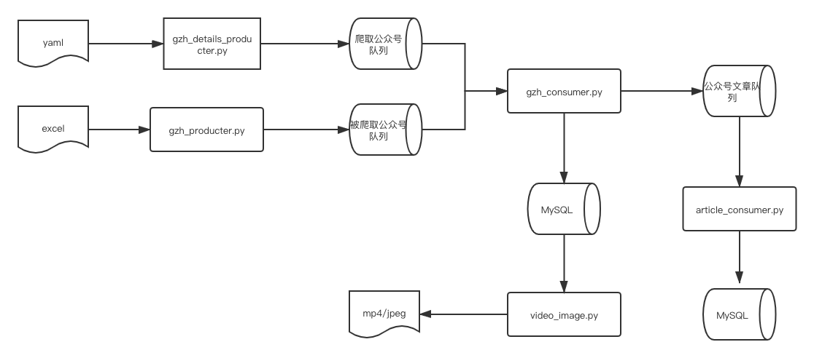

# wx_data_spider
爬取微信公众号数据



## 爬取文章的正文,下载视频、图片
```
python3 video_image.py
```

## 部署

```buildoutcfg
docker network create wx_app_net
docker-compose up -d
```
## TODO

1.镜像优化

## change log

`2021-6-15`

-  添加微信模版消息推送

`2021-6-3`

- 引入redis queue

- 数据流 生产 gzh -> 公众号队列 -> 消费 gzh, 生产文章 -> 公众号文章队列 -> 消费文章,落地阅读量、下载图片

`2021-6-2`

- 根据文章的update_time 过滤增量获取t+1的文章

- 2分钟请求一次，248个公众号文章爬取不需要更换cookie和token,总耗时29552s

`2021-5-22`

- 爬取文章 2分钟一次请求 连续爬取了140+公众号文章

`2021-5-20`

- 公众号爬取每20秒请求一次，大概50个公众号左右触发限流,禁用30～60分钟(网上说法，我实际会较长时间后再操作，后续再验证)
爬取公众号文章10～15秒请求一次，每次取前15篇文章，大概爬取20个公众号左右文章会触发限流,以上限流时限过后重新请求需更换token&cookie

- 爬取文章阅读量和点赞数必须提前用代理工具如charles获取pass_ticket&appmsg_token&key三个参数，目前1～5秒请求一次，30次左右触发流控

ps: 以上仅满足可用并非最优，且仅供学习用途。

